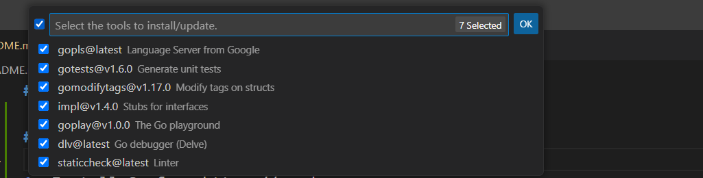

# go-lang-practices

## Setting VS Code for Go Lang Development:

1. Install Go from https://go.dev:
2. once you install set the path and check for ``go version``


3. Install Go Extension:


4. You can install additional tools and update them by using "Go: Install/Update Tools".
``Ctrl+Shift+P`` to open a command pallete and type:``Go: Install/Update Tools``


5. Install Install/Update Tools and select all the tools to install


1. you check on output tab for installation progress:


7. Now we are ready to go for practices.

## How to create a hello world project?
- In go project is called as module
- in the terminal ``go help mod``
- ``go help mod init``
- ``go mod init demo`` here demo is the root package name and it creates file ``go.mod``


- mod file is not mandatory. for now we can go without mod file

- Create hello.go file
  
```go
package main

func main() {
	println("Hello, World!")
}
```
- if you want to create an executable file then we have to keep the package name is main otherwise if you want to use it as a library you can use any package name.

- run ``hello.go`` file with cmd: ``go run hello.go``


- if you change package name and try to run it fails
- it says you are trying to run file without main package


- if you change method name other than main then it will fail 


__Note:__ if you want to run `.go` file as an main application then we need a main package file with main function.

